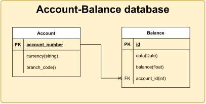
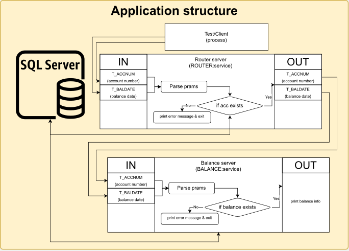

# Balance Router service
Service for managing accounts and balances. Test task [info](./TASK_INFO.md)

## Realization report
The main solution developed by using docker centos container

### Todo
 - [X] [System setup](#system_setup)
	 - [X] [Docker setup](#docker_setup)
	 - [X] [EnduroX setup](#endurox_setup)
	 - [X] [PostrgresSQL setup](#database_setup)
 - [X] [Application design](#application_setup)
	 - [X] [Database structure](#database_structure)
	 - [X] [Application structure](#application_structure)
 - [X] [Tests](./test/README.md)

### <a name="system_setup"></a> System setup
#### <a name="docker_setup"></a> Docker setup
Install docker with centOS. Fist what I done it's pulled cenots container:
`docker pull centos`

The next, it's I've run it couple of times. And after a large time of invetsigations the right command to run the container it's:
```
docker run -itd --privileged -v <Your path to this repo>/balance_db/:/opt/baldb --name="EnduroX" centos:latest /usr/sbin/init
```
For conecting:
```
docker exec -it EnduroX /bin/bash
```
At the start centos has a problem with package manager. So I've createt [script](./centos_setup.sh) which fixes it.
#### <a name="endurox_setup"></a> EnduroX setup
So, that [guide](https://www.endurox.org/dokuwiki/doku.php?id=endurox:v8.0.x:guides:getting_started_tutorial#_creating_the_server_process) helps me a lot. As it's has some amount of copypasta process. The repo consists the [script](./admin_setup) with automaited setup steps.
For installing endurox utils. I've created [script](./endurox_setup.sh) which is downloads and setups provision

#### <a name="database_setup"></a> PostgresSQL setup

### <a name="application_setup"></a> Application design
#### <a name="database_structure"></a> Database structure
Relates to the task requirements the database structure should has following structure:


#### Init database:
```
/usr/pgsql-14/bin/initdb -D /opt/baldb/database/data
```
Connecting to postgreSQL
```
sudo -u postgres psql
```
Creating user:
```
CREATE USER endurox WITH CREATEDB LOGIN ENCRYPTED PASSWORD '000';
CREATE DATABASE endurox;
```
Connecting to database:
```
/usr/pgsql-14/bin/postgres -D database/data
```
Create database:
```
createdb account-balance
```

Create Account table:
```
CREATE TABLE ACCOUNT(
	account_number int NOT NULL,
	currency varchar(5) NOT NULL,
	branch_code int NOT NULL,
	PRIMARY KEY(account_number)
);
```
Create Balance table:
```
CREATE TABLE BALANCE(
	id serial NOT NULL PRIMARY KEY,
	date DATE NOT NULL,
	balance float NOT NULL,
	account_number int,
	CONSTRAINT FK_AccountBalance FOREIGN KEY (account_number)
	REFERENCES ACCOUNT(account_number)
);
```

#### <a name="application_structure"></a> Application structure

